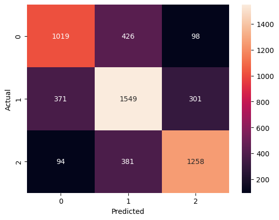
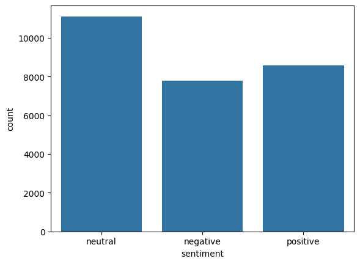

# 🐦 Twitter Sentiment Analysis using Machine Learning

## 📌 Project Overview

This project performs **Sentiment Analysis on Twitter data** using Machine Learning techniques.
The model classifies tweets into:

* 😊 Positive
* 😐 Neutral
* 😡 Negative

It demonstrates the complete NLP pipeline including **text preprocessing, feature extraction, model training, and evaluation**.

---

## 🚀 Features

* Text preprocessing (removing stopwords, punctuation, URLs, mentions)
* Feature extraction using **TF-IDF Vectorization**
* Machine Learning model: **Logistic Regression**
* Model evaluation using:

  * Accuracy Score
  * Confusion Matrix
  * Classification Report
* Data visualization:

  * Sentiment distribution
  * WordCloud

---

## 🛠️ Tech Stack

* Python
* Pandas, NumPy
* NLTK (Natural Language Processing)
* Scikit-learn
* Matplotlib & Seaborn
* WordCloud

---

## 📊 Project Workflow

```
Raw Tweets → Data Cleaning → Text Preprocessing → TF-IDF Vectorization 
→ Model Training → Prediction → Evaluation
```

---

## 📁 Project Structure

```
sentiment-analysis-twitter/
│
├── data/
├── notebook/
├── src/
├── images/
├── requirements.txt
└── README.md
```

---

## 📦 Installation & Setup

### 1. Clone Repository

```
git clone https://github.com/your-username/sentiment-analysis-twitter.git
cd sentiment-analysis-twitter
```

### 2. Create Virtual Environment

```
python -m venv venv
venv\Scripts\activate
```

### 3. Install Dependencies

```
pip install -r requirements.txt
```

---

## ▶️ Usage

Run the Jupyter Notebook:

```
jupyter notebook
```

Or test prediction:

```python
predict("I love this product!")
```

---

## 📈 Results

* Achieved good classification performance using Logistic Regression
* TF-IDF improved feature representation significantly
* Model effectively distinguishes between positive and negative sentiments

---

## 📊 Visualizations

### Confusion Matrix




### Count plot



---

## 💡 Future Improvements

* Use advanced models (Random Forest, SVM, Deep Learning)
* Deploy using Streamlit
* Add real-time Twitter API integration
* Hyperparameter tuning

---

## 🤝 Acknowledgements

* Dataset sourced from Kaggle
* Built as part of a Data Science Internship task

---

## 📬 Contact

If you found this project useful, feel free to connect!

⭐ Don't forget to star the repository!
